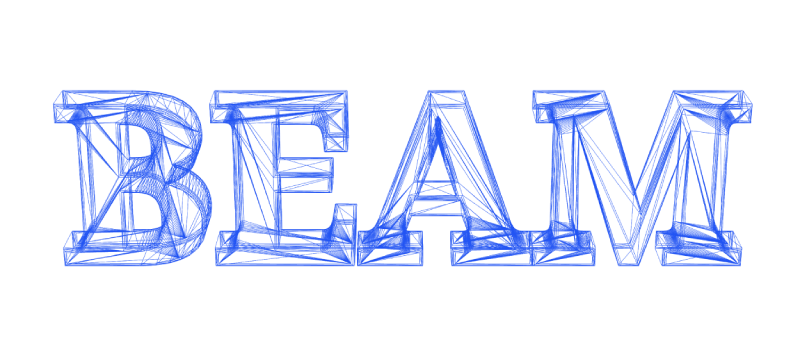
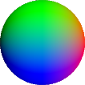
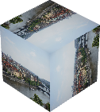
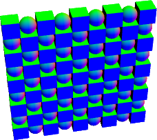
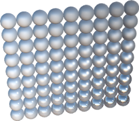

# Beam
Expressive WebGL



## Introduction
Beam is a tiny (<10KB) WebGL library. It's **NOT** a renderer or 3D engine by itself. Instead, Beam provides some essential abstractions, allowing you to build WebGL infrastructures within a very small and easy-to-use API surface.

The WebGL API is known to be verbose, with a steep learning curve. Just like how jQuery simplifies DOM operations, Beam wraps WebGL in a succinct way, making it easier to build WebGL renderers with clean and terse code.

How is this possible? Instead of just reorganizing boilerplate code, Beam defines some essential concepts on top of WebGL, which can be much easier to be understood and used. These highly simplified concepts include:

* **Shaders** - Objects containing graphics algorithms. In contrast of JavaScript that only runs on CPU with a single thread, shaders are run in parallel on GPU, computing colors for millions of pixels every frame.
* **Resources** - Objects containing graphics data. Just like how JSON works in your web app, resources are the data passed to shaders, which mainly includes triangle arrays (aka buffers), image textures, and global options.
* **Draw** - Requests for running shaders with resources. To render a scene, different shaders and resources may be used. You are free to combine them, so as to fire multi draw calls that eventually compose a frame. In fact, each draw call will start the graphics render pipeline for once.
* **Commands** - Setups before firing a draw call. WebGL is *very* stateful. Before every draw call, WebGL states must be carefully configured. These changes are indicated via commands. Beam makes use of conventions that greatly reduces manual command maintenance. Certainly you can also define and run custom commands easily.

Since commands can be mostly automated, there are only 3 concepts for beginners to learn, represented by 3 core APIs in Beam: **beam.shader**, **beam.resource** and **beam.draw**. Conceptually only with these 3 methods, you can build a WebGL app.

## Installation
``` bash
npm install beam-gl
```

Or you can clone this repository and start a static HTTP server to try it out. Beam runs directly in modern browser, without any need to build or compile.

## Hello World with Beam
Now we are going to write a simplest WebGL app with Beam, which renders a colorful triangle:


Here is the code snippet:

``` js
import { Beam, ResourceTypes } from 'beam-gl'
import { MyShader } from './my-shader.js'
const { VertexBuffers, IndexBuffer } = ResourceTypes

// Remember to create a `<canvas>` element in HTML
const canvas = document.querySelector('canvas')
// Init Beam instance
const beam = new Beam(canvas)

// Init shader for triangle rendering
const shader = beam.shader(MyShader)

// Init vertex buffer resource
const vertexBuffers = beam.resource(VertexBuffers, {
  position: [
    -1, -1, 0, // vertex 0, bottom left
    0, 1, 0, // vertex 1, top middle
    1, -1, 0 // vertex 2, bottom right
  ],
  color: [
    1, 0, 0, // vertex 0, red
    0, 1, 0, // vertex 1, green
    0, 0, 1 // vertex 2, blue
  ]
})
// Init index buffer resource with 3 indices
const indexBuffer = beam.resource(IndexBuffer, {
  array: [0, 1, 2]
})

// Clear the screen, then draw with shader and resources
beam
  .clear()
  .draw(shader, vertexBuffers, indexBuffer)
```

Now let's take a look at some pieces of code in this example. Firstly we need to init Beam instance with a canvas:

``` js
const canvas = document.querySelector('canvas')
const beam = new Beam(canvas)
```

Then we can init a shader with `beam.shader`. The content in `MyShader` will be explained later:

``` js
const shader = beam.shader(MyShader)
```

For the triangle, use the `beam.resource` API to create its data, which is contained in different buffers. Beam use the `VertexBuffers` type to represent them. There are 3 vertices in the triangle, each vertex has two attributes, which is **position** and **color**. Every vertex attribute has its vertex buffer, which can be declared as a flat and plain JavaScript array (or TypedArray). Beam will upload these data to GPU behind the scene:

``` js
const vertexBuffers = beam.resource(VertexBuffers, {
  position: [
    -1, -1, 0, // vertex 0, bottom left
    0, 1, 0, // vertex 1, top middle
    1, -1, 0 // vertex 2, bottom right
  ],
  color: [
    1, 0, 0, // vertex 0, red
    0, 1, 0, // vertex 1, green
    0, 0, 1 // vertex 2, blue
  ]
})
```

Vertex buffers usually contain a compact dataset. We can define a subset or superset of which to render, so that we can reduce redundancy and reuse more vertices. To do that we need to introduce another type of buffer called `IndexBuffer`, which contains indices of the vertices in `vertexBuffers`:

``` js
const indexBuffer = beam.resource(IndexBuffer, {
  array: [0, 1, 2]
})
```

> In this example, each index refers to 3 spaces in the vertex array.

Finally we can render with WebGL. `beam.clear` can clear the frame, then the chainable `beam.draw` can draw with **one shader object and multi resource objects**:

``` js
beam
  .clear()
  .draw(shader, vertexBuffers, indexBuffer)
```

The `beam.draw` API is flexible, if you have multi shaders and resources, just combine them to make draw calls at your wish, composing a complex scene:

``` js
beam
  .draw(shaderX, ...resourcesA)
  .draw(shaderY, ...resourcesB)
  .draw(shaderZ, ...resourcesC)
```

There's one missing point: How to decide the render algorithm of the triangle? This is done in the `MyShader` variable, which is a schema of the shader object, and it looks like this:

``` js
import { SchemaTypes } from 'beam-gl'

const vertexShader = `
attribute vec4 position;
attribute vec4 color;
varying highp vec4 vColor;
void main() {
  vColor = color;
  gl_Position = position;
}
`
const fragmentShader = `
varying highp vec4 vColor;
void main() {
  gl_FragColor = vColor;
}
`

const { vec4 } = SchemaTypes
export const MyShader = {
  vs: vertexShader,
  fs: fragmentShader,
  buffers: {
    position: { type: vec4, n: 3 },
    color: { type: vec4, n: 3 }
  }
}
```

This shows a simple shader schema in Beam, which is made of a string for vertex shader, a string for fragment shader, and other schema fields. From a very brief view, vertex shader is executed once per vertex, and fragment shader is executed once per pixel. They are written in the GLSL shader language. In WebGL, the vertex shader always writes to `gl_Position` as its output, and the fragment shader writes to  `gl_FragColor` for final pixel color. The `vColor` varying variable is interpolated and passed from vertex shader to fragment shader, and the `position` and `color` vertex attribute variables, are corresponding to the buffer keys in `vertexBuffers`. That's a convention to simplify boilerplates.

## Build Something Bigger
Now we have known how to render a triangle with Beam. What's next? Here is a very brief guide, showing how can we use Beam to handle more complex WebGL scenarios:

### Render 3D Graphics
The "Hello World" triangle we have drawn, is just a 2D shape. How about boxes, balls, and other complex 3D models? Just a little bit more vertices and shader setups. Let's see how to render following 3D ball in Beam:



3D graphics are composed of triangles, which are still further composed of vertices. For the triangle example, every vertex has two attributes, which is **position** and **color**. For a basic 3D ball, we need to talk about **position** and **normal**. The normal attribute contains the vector perpendicular to the ball at that position, which is critical to compute lighting.

Moreover, to transform a vertex from 3D space to 2D screen coordinates, we need a "camera", which is compsed of matrices. For each vertex being passed to the vertex shader, we should apply same transform matrices to it. These matrix variables are "global" to all shaders running in parallel, which is called **uniforms** in WebGL. `Uniforms` is also a resource type in Beam, containing multi global options for shaders, like camera positions, line colors, effect strength factors and so on.

So to render a simplest ball, we can reuse exactly the same fragment shader as the triangle example, just update the vertex shader string as following:

``` glsl
attribute vec4 position;
attribute vec4 normal;

// Transform matrices
uniform mat4 modelMat;
uniform mat4 viewMat;
uniform mat4 projectionMat;

varying highp vec4 vColor;

void main() {
  gl_Position = projectionMat * viewMat * modelMat * position;
  vColor = normal; // visualize normal vector
}
```

Since we have added uniform variables in shader, the schema should also be updated, with a new `uniforms` field:

``` js
const identityMat = [1, 0, 0, 0, 0, 1, 0, 0, 0, 0, 1, 0, 0, 0, 0, 1]
const { vec4, mat4 } = SchemaTypes

export const MyShader = {
  vs: vertexShader,
  fs: fragmentShader,
  buffers: {
    position: { type: vec4, n: 3 },
    normal: { type: vec4, n: 3 }
  },
  uniforms: {
    // The default field is handy for reducing boilerplate
    modelMat: { type: mat4, default: identityMat },
    viewMat: { type: mat4 },
    projectionMat: { type: mat4 }
  }
}
```

Then we can still write expressive WebGL render code:

``` js
const beam = new Beam(canvas)

const shader = beam.shader(NormalColor)
const cameraMats = createCamera({ eye: [0, 10, 10] })
const ball = createBall()

beam.clear().draw(
  shader,
  beam.resource(VertexBuffers, ball.data),
  beam.resource(IndexBuffer, ball.index),
  beam.resource(Uniforms, cameraMats)
)
```

And that's all. See the [Basic Ball](./gallery/pages/basic-graphics/basic-ball.js) page for a working example.

> Beam is a WebGL library without 3D assumptions. So graphics objects and matrix algorithms are not part of it. For convenience there are some related utils shipping with Beam examples, but don't expect too strict on them.

### Animate Graphics
How to move the graphics object in WebGL? Certainly you can update the buffers with new positions, but that can be quite slow. Another solution is to just update the tranform matrices we mentioned above, which are uniforms, very small pieces of options.

With the `requestAnimationFrame` API, we can easily zoom the ball we rendered before:

``` js
const beam = new Beam(canvas)

const shader = beam.shader(NormalColor)
const ball = createBall()
const buffers = [
  beam.resource(VertexBuffers, ball.data),
  beam.resource(IndexBuffer, ball.index)
]
let i = 0; let d = 10
const cameraMats = createCamera({ eye: [0, d, d] })
const camera = beam.resource(Uniforms, cameraMats)

const tick = () => {
  i += 0.02
  d = 10 + Math.sin(i) * 5
  const { viewMat } = createCamera({ eye: [0, d, d] })

  // Update uniform resource
  camera.set('viewMat', viewMat)

  beam.clear().draw(shader, ...buffers, camera)
  requestAnimationFrame(tick)
}
tick() // Begin render loop
```

The `camera` variable is a `Uniforms` resource instance in Beam, whose data are stored in key-value pairs. You are free to add or modify different uniform keys. When `beam.draw` is fired, only the keys that match the shader will be uploaded to GPU.

See the [Zooming Ball](./gallery/pages/basic-graphics/zooming-ball.js) page for a working example.

> Buffer resources also supports `set()` in a similar way. Make sure you know what you are doing, since this can be slow for heavy workload in WebGL.

### Render Images
We have met the `VertexBuffers`, `IndexBuffer` and `Uniforms` resouce types in Beam. If we want to render an image, we need the last critical resouce type, which is `Textures`. A basic related example would be a 3D box with image like this:



For graphics with texture, besides the **position** and **normal**, we need an extra **texCoord** attribute, which aligns the image to the graphics at that position, and also being interpolated in the fragment shader. See the new vertex shader:

``` glsl
attribute vec4 position;
attribute vec4 normal;
attribute vec2 texCoord;

uniform mat4 modelMat;
uniform mat4 viewMat;
uniform mat4 projectionMat;

varying highp vec2 vTexCoord;

void main() {
  vTexCoord = texCoord;
  gl_Position = projectionMat * viewMat * modelMat * position;
}
```

And the new fragment shader:

``` glsl
uniform sampler2D img;
uniform highp float strength;

varying highp vec2 vTexCoord;

void main() {
  gl_FragColor = texture2D(img, vTexCoord);
}
```

Now we need a new shader schema with `textures` field:

``` js
const { vec4, vec2, mat4, tex2D } = SchemaTypes
export const MyShader = {
  vs: vertexShader,
  fs: fragmentShader,
  buffers: {
    position: { type: vec4, n: 3 },
    texCoord: { type: vec2 }
  },
  uniforms: {
    modelMat: { type: mat4, default: identityMat },
    viewMat: { type: mat4 },
    projectionMat: { type: mat4 }
  },
  textures: {
    img: { type: tex2D }
  }
}
```

And finally let's checkout the render logic:

``` js
const beam = new Beam(canvas)

const shader = beam.shader(MyShader)
const cameraMats = createCamera({ eye: [10, 10, 10] })
const box = createBox()

loadImage('prague.jpg').then(image => {
  const imageState = { image, flip: true }
  beam.clear().draw(
    shader,
    beam.resource(VertexBuffers, box.data),
    beam.resource(IndexBuffer, box.index),
    beam.resource(Uniforms, cameraMats),
    // The 'img' key is defined to match the shader
    beam.resource(Textures, { img: imageState })
  )
})
```

That's all for basic texture resource usage. Since we have direct access to image shaders, we can also easily add image processing effects with Beam.

See the [Image Box](./gallery/pages/basic-graphics/image-box.js) page for a working example.

> You are free to replace the `createBox` with `createBall` and see the difference.

### Render Multi Objects
How to render different graphics objects? Let's see the flexibility of `beam.draw` API:



To render multi balls and multi boxes, we only need 2 group of `VertexBuffers` and `IndexBuffer`, one for ball and one for box:

``` js
const shader = beam.shader(MyShader)
const ball = createBall()
const box = createBox()
const ballBuffers = [
  beam.resource(VertexBuffers, ball.data),
  beam.resource(IndexBuffer, ball.index)
]
const boxBuffers = [
  beam.resource(VertexBuffers, box.data),
  beam.resource(IndexBuffer, box.index)
]
```

Then in a `for` loop, we can easily draw them with different uniform options. By changing `modelMat` before `beam.draw`, we can update an object's position in world space, so that the box and ball can both appear on screen multi times:

``` js
const cameraMats = createCamera(
  { eye: [0, 50, 50], center: [10, 10, 0] }
)
const camera = beam.resource(Uniforms, cameraMats)
const baseMat = mat4.create()

const render = () => {
  beam.clear()
  for (let i = 1; i < 10; i++) {
    for (let j = 1; j < 10; j++) {
      const modelMat = mat4.translate(
        [], baseMat, [i * 2, j * 2, 0]
      )
      camera.set('modelMat', modelMat)
      const resources = (i + j) % 2
        ? ballBuffers
        : boxBuffers

      beam.draw(shader, ...resources, camera)
    }
  }
}

render()
```

The `render` function begins with a `beam.clear`, then we're free to use `beam.draw` that makes up complex render logic.

See the [Multi Graphics](./gallery/pages/basic-graphics/multi-graphics.js) page for a working example.

### Offscreen Rendering
In WebGL we use framebuffer object for offscreen rendering, which renders the output to a texture. Beam has a corresponding `OffscreenTarget` resource type. Note that this type of resource can't be passed in `beam.draw`.

Say the default render logic looks something like:

``` js
beam
  .clear()
  .draw(shaderX, ...resourcesA)
  .draw(shaderY, ...resourcesB)
  .draw(shaderZ, ...resourcesC)
```

With the optional `offscreen2D` method, this render logic can be simply nested in a function scope in this way:

``` js
beam.clear()
beam.offscreen2D(offscreenTarget, () => {
  beam
    .draw(shaderX, ...resourcesA)
    .draw(shaderY, ...resourcesB)
    .draw(shaderZ, ...resourcesC)
})
```

This simply redirects the render output to the offscreen texture resource.

See the [Basic Mesh](./gallery/pages/offscreen/basic-mesh.js) page for a working example.

### Advanced Render Techniques
For realtime rendering, physically based rendering (PBR) and shadow mapping are two major advanced techniques. Beam has demonstrated basic support of them in examples, like these PBR material balls:



These examples focus more on readability instead of completeness. To get started, checkout:

* [Material Ball](./gallery/pages/3d-models/material-ball.js) page for a working PBR example.
* [Basic Shadow](./gallery/pages/offscreen/basic-shadow.js) page for a working shadow mapping example.

## More Examples
See [Beam Examples](https://doodlewind.github.io/beam/examples.html) for more versatile WebGL snippets based on Beam, including:

* Render multi 3D objects
* Mesh loading
* Texture config
* Classic lighting
* Physically based rendering (PBR)
* Chainable Image Filters
* Offscreen rendering (using FBO)
* Shadow mapping
* Basic particles
* WebGL extension config
* Customize your renderers

Pull requests for new examples are also welcomed :)

## License
MIT
